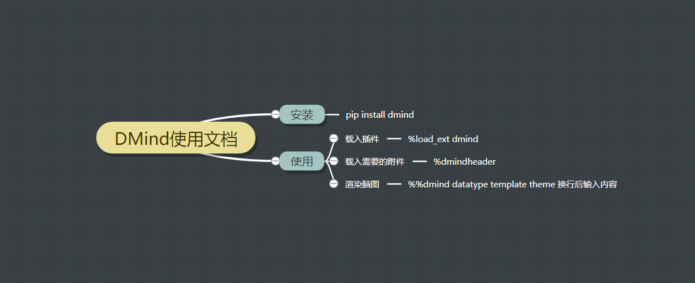
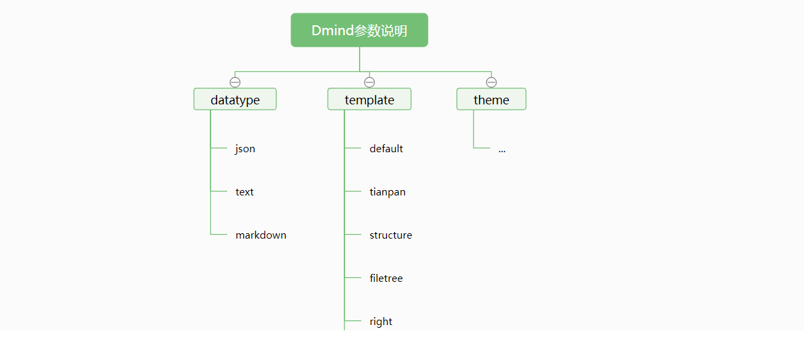
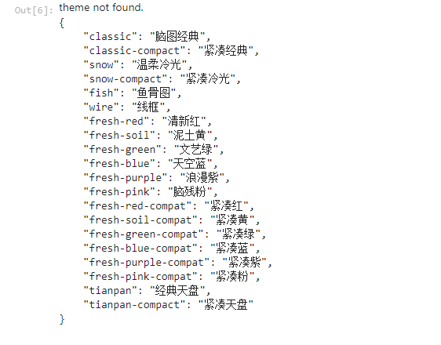

<h1>jupyter学习指南</h1>
[TOC]

# jupyter环境配置

```
conda create --name learn_jupyter python=3.8 
conda activate learn_jupyter
pip install jupyter
pip install rise 
pip install dmind
pip install jupyter_contrib_nbextensions
jupyter contrib nbextension install --user --skip-running-check
```

# 启动jupyter

命令行：jupyter notebook

Edit->Edit Notebook Metadata
```
"rise": {
    "autolaunch": true,
    "enable_chalkboard": true
  }
```

# 思维导图插件使用

## 介绍
DMind 是一个 Jupyter notebook 的思维导图插件.

利用百度脑图的开源库实现渲染, 支持 json, markdown, text 格式.

[Github地址](https://github.com/dust8/dmind)
## 安装

通过 pip 安装

    pip install dmind
    
## 使用

引入插件相关

### 载入 dmind 插件

%load_ext dmind

###  载入 dmind 需要的附件

%dmindheader

###  text 格式


```python
%reload_ext dmind
%dmindheader
```


```python
%%dmind text
DMind
    是一个 jupyter notebook 插件
    是一个思维导图插件
```


### markdown 格式, 逻辑结构图


```python
%%dmind markdown right

# DMind使用文档
## 安装
### pip install dmind
## 使用
### 载入插件
#### %load_ext dmind
### 载入需要的附件
#### %dmindheader
### 渲染脑图
#### %%dmind datatype template theme 换行后输入内容

```


### json 格式 , 目录组织图, 文艺绿


```python
%%dmind json filetree fresh-green
{
    "root": {
        "data": {
            "text": "Dmind参数说明"
        },
        "children": [
            {
                "data": {
                    "text": "datatype"
                },
                "children": [
                    {
                        "data": {
                            "text": "json"
                        }
                    },
                    {
                        "data": {
                            "text": "text"
                        }
                    },
                    {
                        "data": {
                            "text": "markdown"
                        }
                    }
                ]
            },
            {
                "data": {
                    "text": "template"
                },
                "children": [
                    {
                        "data": {
                            "text": "default"
                        }
                    },
                    {
                        "data": {
                            "text": "tianpan"
                        }
                    },
                    {
                        "data": {
                            "text": "structure"
                        }
                    },
                    {
                        "data": {
                            "text": "filetree"
                        }
                    },
                    {
                        "data": {
                            "text": "right"
                        }
                    },
                    {
                        "data": {
                            "text": "fish-bone"
                        }
                    }
                ]
            },
            {
                "data": {
                    "text": "theme"
                },
                "children": [
                    {
                        "data": {
                            "text": "..."
                        }
                    }
                ]
            }
        ]
    }
}
```


### 通过输入错误的参数值查看参数列表


```python
%%dmind json filetree errortheme

查看参数
```


# 学习jupyter示例
[学习jupyter示例](https://github.com/leigangblog/learn_jupyter/learn_jupyter.ipynb)